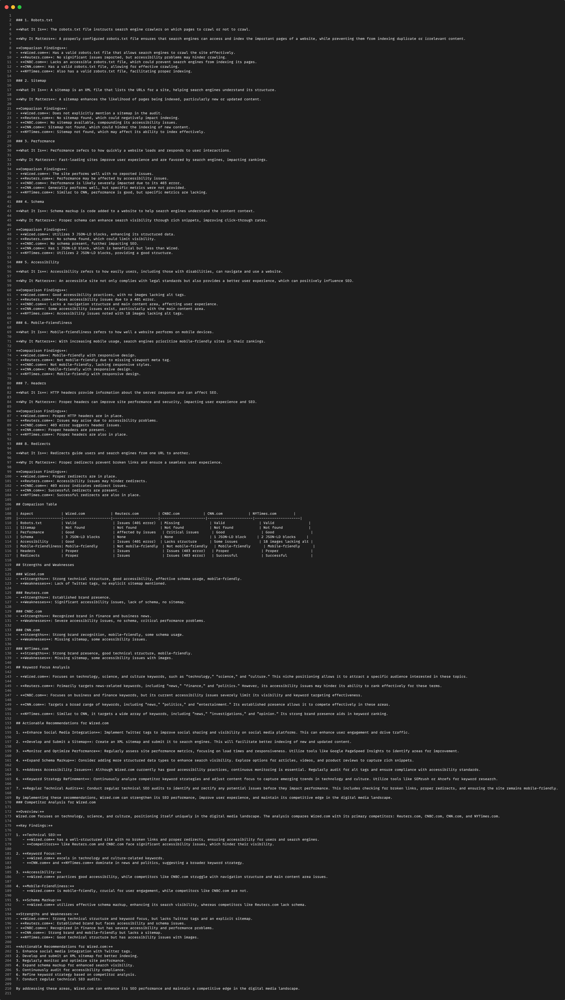
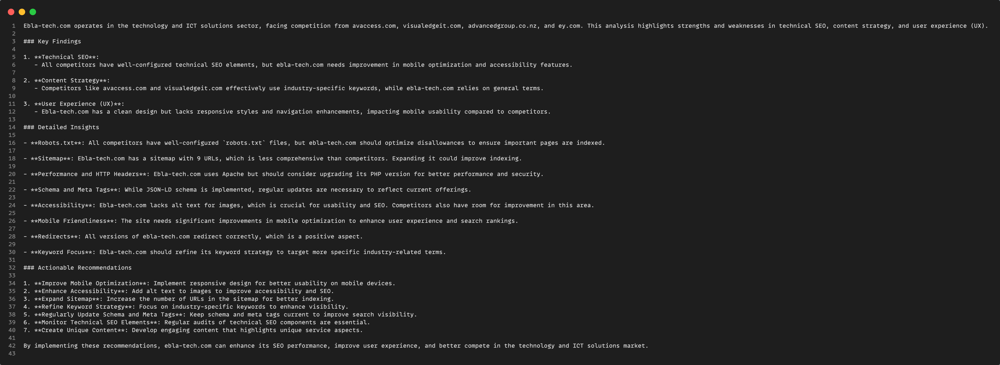
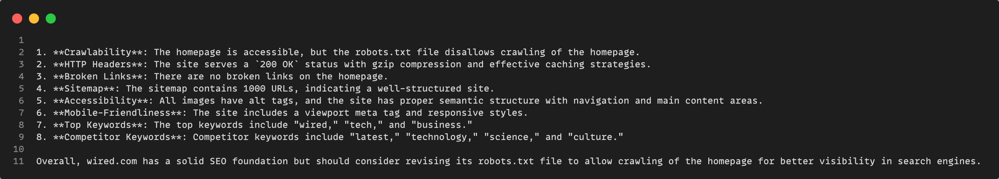

# SeoScan Agent

## Abstract

SeoScan Agent is a modular, agentic SEO auditing toolkit that leverages modern LLMs (OpenAI, Ollama, etc.), advanced tool orchestration, and robust web scraping to perform comprehensive, fully-automated SEO audits and competitor benchmarking.
SeoScan is designed for extensibility and transparency, allowing deep technical, content, UX, and competitive SEO analysis for any website.

⸻

Features
	•	Agentic, modular architecture using LlamaIndex (ReActAgent)
	•	Multi-agent orchestration (technical, content, UX, competitor)
	•	Automated web crawling, keyword extraction, Lighthouse/PageSpeed, schema/meta parsing
	•	Competitor discovery via Google (SerpAPI)
	•	Support for both OpenAI and Ollama models

⸻

## Setup and Usage

### 1. Clone the Repository
```bash
git clone https://github.com/Bahaatbb/SEO-Scan.git
cd SEO-Scan
```
<hr/>

### 2. Create and Activate a Conda Environment

```bash
conda create -n seoscan python=3.10
conda activate seoscan
```
<hr/>
### 3. Install Dependencies

```bash
# Ensure pip is up to date
python -m pip install --upgrade pip

# Install required libraries
pip install -r requirements.txt
```
### If you need to install a package separately (if any error appears), run:


```bash
pip install llama-index
pip install python-dotenv requests beautifulsoup4
# For Ollama LLM support (optional)
pip install llama-index-llms-ollama
```
<hr/>

### 4. Configure API Keys
### Copy .env.example to .env (or create .env):

```bash
SERPAPI_KEY=your-serpapi-key
GOOGLE_PSI_API_KEY=your-pagespeedonline-key
OPENAI_API_KEY=your-openai-key
```
<hr />

### 5. Run the Application
### From the parent directory of your seoscan_agent folder, run:

```bash
python -m seoscan_agent.main
```
<hr/>

### You will see a prompt. Enter SEO queries or domain names as needed, e.g.:
#### examples: 
```
SEO audit for aljazeera.com
Do a competitor analysis on wired.com
is ebla-tech.com mobile friendly.
is the robots.txt of tripadvisor.com good 
...
...
...
```


## Examples
exmample answers

See  for sample queries and usage examples.
See  for sample queries and usage examples.
See  for sample queries and usage examples.